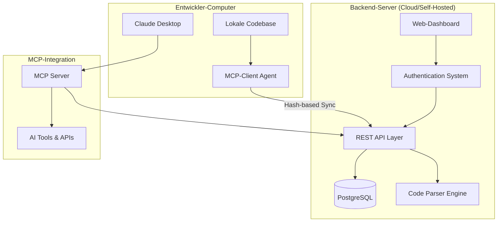

# Watcher Pro → MCP Integration Roadmap

## 🎯 Vision & Zielsetzung

**Transformiere Watcher Pro in ein verteiltes Code-Intelligence-System mit MCP-Integration für Claude AI.**

Das Ziel ist es, ein System zu schaffen, das:
- Lokale Projekte automatisch analysiert und synchronisiert
- Entwicklern ermöglicht, Claude mit kontextuellem Code-Wissen zu versorgen
- Eine skalierbare, sichere Multi-User-Plattform bereitstellt
- Echtzeit-Code-Intelligence für AI-gestützte Entwicklung bietet

---

## 🏗️ System-Architektur-Übersicht



### 🔄 Datenfluss-Architektur

1. **Lokaler MCP-Client** überwacht Dateisystem-Änderungen
2. **Hash-basierte Erkennung** identifiziert nur tatsächliche Änderungen
3. **Sichere API-Übertragung** synchronisiert mit Backend-Server
4. **Code-Parser-Engine** extrahiert strukturierte Fakten
5. **PostgreSQL-Storage** persistiert alle Code-Intelligence-Daten
6. **MCP-Server** stellt Claude-kompatible Tools bereit
7. **Claude AI** nutzt kontextuelle Code-Informationen für bessere Antworten

---

## 🎨 Komponenten-Detail-Design

### 1. Backend-Server Erweiterungen

#### 1.1 User-Management-System

**Database-Schema-Erweiterungen:**
```sql
-- Benutzer-Verwaltung
CREATE TABLE users (
    id UUID PRIMARY KEY DEFAULT gen_random_uuid(),
    email VARCHAR(255) UNIQUE NOT NULL,
    username VARCHAR(100) UNIQUE NOT NULL,
    password_hash VARCHAR(255) NOT NULL,
    email_verified BOOLEAN DEFAULT FALSE,
    created_at TIMESTAMPTZ DEFAULT NOW(),
    updated_at TIMESTAMPTZ DEFAULT NOW(),
    last_login_at TIMESTAMPTZ,
    status VARCHAR(20) DEFAULT 'active', -- active, suspended, deleted
    plan_type VARCHAR(20) DEFAULT 'free', -- free, pro, enterprise
    settings JSONB DEFAULT '{}'
);

-- Sessions & JWT-Management
CREATE TABLE user_sessions (
    id UUID PRIMARY KEY DEFAULT gen_random_uuid(),
    user_id UUID REFERENCES users(id) ON DELETE CASCADE,
    token_hash VARCHAR(255) NOT NULL,
    expires_at TIMESTAMPTZ NOT NULL,
    created_at TIMESTAMPTZ DEFAULT NOW(),
    revoked_at TIMESTAMPTZ,
    user_agent TEXT,
    ip_address INET
);

-- API-Key-Management
CREATE TABLE api_keys (
    id UUID PRIMARY KEY DEFAULT gen_random_uuid(),
    user_id UUID REFERENCES users(id) ON DELETE CASCADE,
    name VARCHAR(100) NOT NULL,
    key_hash VARCHAR(255) NOT NULL,
    key_prefix VARCHAR(20) NOT NULL, -- wcp_abc123... (ersten 10 Zeichen für UI)
    scopes TEXT[] DEFAULT '{}', -- ['read', 'write', 'admin']
    rate_limit_per_hour INTEGER DEFAULT 1000,
    expires_at TIMESTAMPTZ,
    last_used_at TIMESTAMPTZ,
    usage_count BIGINT DEFAULT 0,
    created_at TIMESTAMPTZ DEFAULT NOW(),
    revoked_at TIMESTAMPTZ
);

-- Projekte pro User
CREATE TABLE projects (
    id UUID PRIMARY KEY DEFAULT gen_random_uuid(),
    user_id UUID REFERENCES users(id) ON DELETE CASCADE,
    name VARCHAR(200) NOT NULL,
    description TEXT,
    root_path TEXT NOT NULL,
    language_primary VARCHAR(50), -- go, javascript, python, etc.
    languages JSONB DEFAULT '[]', -- detected languages
    total_files INTEGER DEFAULT 0,
    total_lines INTEGER DEFAULT 0,
    last_sync_at TIMESTAMPTZ,
    created_at TIMESTAMPTZ DEFAULT NOW(),
    updated_at TIMESTAMPTZ DEFAULT NOW(),
    settings JSONB DEFAULT '{}' -- ignore patterns, include extensions, etc.
);

-- API-Usage-Tracking
CREATE TABLE api_usage (
    id UUID PRIMARY KEY DEFAULT gen_random_uuid(),
    api_key_id UUID REFERENCES api_keys(id) ON DELETE CASCADE,
    endpoint VARCHAR(255) NOT NULL,
    method VARCHAR(10) NOT NULL,
    status_code INTEGER NOT NULL,
    response_time_ms INTEGER,
    request_size_bytes INTEGER,
    response_size_bytes INTEGER,
    created_at TIMESTAMPTZ DEFAULT NOW()
);

-- Erweitere bestehende tables für Multi-User
ALTER TABLE files ADD COLUMN project_id UUID REFERENCES projects(id) ON DELETE CASCADE;
ALTER TABLE symbols ADD COLUMN project_id UUID REFERENCES projects(id) ON DELETE CASCADE;
ALTER TABLE deps ADD COLUMN project_id UUID REFERENCES projects(id) ON DELETE CASCADE;
ALTER TABLE api_endpoints ADD COLUMN project_id UUID REFERENCES projects(id) ON DELETE CASCADE;
ALTER TABLE strs ADD COLUMN project_id UUID REFERENCES projects(id) ON DELETE CASCADE;
ALTER TABLE comments ADD COLUMN project_id UUID REFERENCES projects(id) ON DELETE CASCADE;
```

#### 1.2 Web-Dashboard-Design

**Frontend-Technologie-Stack:**
- **Framework:** React 18 mit TypeScript
- **Styling:** Tailwind CSS + Headless UI
- **State-Management:** Zustand
- **HTTP-Client:** Axios mit Interceptors
- **Routing:** React Router v6
- **Forms:** React Hook Form + Zod-Validation
- **Charts:** Recharts für Analytics
- **Icons:** Heroicons

**Dashboard-Komponenten-Struktur:**
```
src/
├── components/
│   ├── auth/
│   │   ├── LoginForm.tsx
│   │   ├── RegisterForm.tsx
│   │   ├── ForgotPasswordForm.tsx
│   │   └── EmailVerification.tsx
│   ├── dashboard/
│   │   ├── DashboardLayout.tsx
│   │   ├── ProjectCard.tsx
│   │   ├── ProjectList.tsx
│   │   ├── StatsOverview.tsx
│   │   └── RecentActivity.tsx
│   ├── projects/
│   │   ├── ProjectDetails.tsx
│   │   ├── ProjectSettings.tsx
│   │   ├── FileExplorer.tsx
│   │   └── CodeMetrics.tsx
│   ├── api-keys/
│   │   ├── APIKeyManager.tsx
│   │   ├── APIKeyForm.tsx
│   │   ├── APIKeyList.tsx
│   │   └── UsageMetrics.tsx
│   └── shared/
│       ├── Header.tsx
│       ├── Sidebar.tsx
│       ├── LoadingSpinner.tsx
│       └── ErrorBoundary.tsx
├── hooks/
│   ├── useAuth.ts
│   ├── useProjects.ts
│   ├── useAPIKeys.ts
│   └── useWebSocket.ts
├── services/
│   ├── api.ts
│   ├── auth.ts
│   └── websocket.ts
├── types/
│   ├── user.ts
│   ├── project.ts
│   └── api.ts
└── utils/
    ├── constants.ts
    ├── helpers.ts
    └── validation.ts
```

**Dashboard-Features:**
1. **Authentication-Flow**
   - Email/Password-Registration mit Verification
   - Sichere Login mit JWT-Tokens
   - Password-Reset-Funktionalität
   - OAuth-Integration (GitHub, Google) - Future

2. **Project-Management**
   - Project-Overview mit Metrics
   - File-Tree-Browser mit Syntax-Highlighting
   - Code-Search innerhalb Projekte
   - Language-Statistics und File-Type-Analysis

3. **API-Key-Management**
   - Key-Generation mit Custom-Names
   - Scope-Selection (Read/Write/Admin)
   - Usage-Analytics und Rate-Limit-Monitoring
   - Key-Rotation und Revocation

4. **Real-time-Updates**
   - WebSocket-Integration für Live-Updates
   - Sync-Status-Tracking von MCP-Clients
   - Activity-Feed für alle Projektänderungen
   - System-Health-Monitoring

#### 1.3 API-Layer-Erweiterungen

**Neue REST-Endpoints:**

```go
// Authentication-Endpoints
POST   /api/v1/auth/register          // User-Registration
POST   /api/v1/auth/login             // User-Login (JWT)
POST   /api/v1/auth/logout            // Token-Invalidation
POST   /api/v1/auth/refresh           // Token-Refresh
POST   /api/v1/auth/forgot-password   // Password-Reset-Request
POST   /api/v1/auth/reset-password    // Password-Reset-Confirmation
GET    /api/v1/auth/verify-email      // Email-Verification

// User-Management
GET    /api/v1/user/profile           // Current User-Profile
PUT    /api/v1/user/profile           // Update User-Profile
DELETE /api/v1/user/account           // Account-Deletion
GET    /api/v1/user/usage             // Usage-Statistics

// Project-Management
GET    /api/v1/projects               // List User-Projects
POST   /api/v1/projects               // Create New Project
GET    /api/v1/projects/{id}          // Project-Details
PUT    /api/v1/projects/{id}          // Update Project
DELETE /api/v1/projects/{id}          // Delete Project
GET    /api/v1/projects/{id}/stats    // Project-Statistics

// API-Key-Management
GET    /api/v1/api-keys               // List User-API-Keys
POST   /api/v1/api-keys               // Create New API-Key
PUT    /api/v1/api-keys/{id}          // Update API-Key (Name, Scopes)
DELETE /api/v1/api-keys/{id}          // Revoke API-Key
GET    /api/v1/api-keys/{id}/usage    // API-Key-Usage-Statistics

// Client-Sync-Endpoints (API-Key-Authentication)
POST   /api/v1/sync/register-client   // Register MCP-Client
POST   /api/v1/sync/heartbeat         // Client-Heartbeat
POST   /api/v1/sync/hash-comparison   // Compare File-Hashes
POST   /api/v1/sync/upload            // Upload Changed Files
GET    /api/v1/sync/download/{hash}   // Download File by Hash
POST   /api/v1/sync/batch-upload      // Batch-Upload Multiple Files
GET    /api/v1/sync/status            // Sync-Status for Project

// Enhanced Code-Facts-Endpoints
GET    /api/v1/facts/search           // Search across all User-Projects
GET    /api/v1/facts/symbols          // Symbol-Search with Filters
GET    /api/v1/facts/dependencies     // Dependency-Graph-Analysis
GET    /api/v1/facts/metrics          // Code-Metrics & Quality-Scores
GET    /api/v1/facts/similar          // Find similar Code-Patterns
```

**API-Authentication-Middleware:**
```go
package middleware

import (
    "context"
    "net/http"
    "strings"
    "time"

    "github.com/golang-jwt/jwt/v5"
)

type APIKeyMiddleware struct {
    store *storage.Store
}

func (m *APIKeyMiddleware) Authenticate(next http.Handler) http.Handler {
    return http.HandlerFunc(func(w http.ResponseWriter, r *http.Request) {
        // Unterstütze sowohl JWT (Web-UI) als auch API-Keys (MCP-Client)
        auth := r.Header.Get("Authorization")

        if strings.HasPrefix(auth, "Bearer ") {
            // JWT-Token für Web-UI
            token := strings.TrimPrefix(auth, "Bearer ")
            userID, err := m.validateJWTToken(token)
            if err != nil {
                http.Error(w, "Invalid JWT token", http.StatusUnauthorized)
                return
            }
            ctx := context.WithValue(r.Context(), "user_id", userID)
            ctx = context.WithValue(ctx, "auth_type", "jwt")
            next.ServeHTTP(w, r.WithContext(ctx))

        } else if strings.HasPrefix(auth, "ApiKey ") {
            // API-Key für MCP-Client
            apiKey := strings.TrimPrefix(auth, "ApiKey ")
            key, err := m.validateAPIKey(apiKey)
            if err != nil {
                http.Error(w, "Invalid API key", http.StatusUnauthorized)
                return
            }

            // Rate-Limiting-Check
            if err := m.checkRateLimit(key); err != nil {
                http.Error(w, "Rate limit exceeded", http.StatusTooManyRequests)
                return
            }

            // Update Last-Used und Usage-Count
            _ = m.updateAPIKeyUsage(key.ID)

            ctx := context.WithValue(r.Context(), "user_id", key.UserID)
            ctx = context.WithValue(ctx, "api_key_id", key.ID)
            ctx = context.WithValue(ctx, "scopes", key.Scopes)
            ctx = context.WithValue(ctx, "auth_type", "api_key")
            next.ServeHTTP(w, r.WithContext(ctx))

        } else {
            http.Error(w, "Missing or invalid authorization header", http.StatusUnauthorized)
            return
        }
    })
}

func (m *APIKeyMiddleware) RequireScope(scope string) func(http.Handler) http.Handler {
    return func(next http.Handler) http.Handler {
        return http.HandlerFunc(func(w http.ResponseWriter, r *http.Request) {
            authType := r.Context().Value("auth_type").(string)

            if authType == "jwt" {
                // JWT-Tokens haben alle Permissions
                next.ServeHTTP(w, r)
                return
            }

            scopes := r.Context().Value("scopes").([]string)
            for _, s := range scopes {
                if s == scope || s == "admin" {
                    next.ServeHTTP(w, r)
                    return
                }
            }

            http.Error(w, "Insufficient permissions", http.StatusForbidden)
        })
    }
}
```

### 2. MCP-Client Development

#### 2.1 Client-Architektur

**Hauptkomponenten:**
```
mcp-client/
├── cmd/
│   └── mcp-client/
│       └── main.go                    # CLI Entry-Point
├── internal/
│   ├── config/
│   │   ├── config.go                  # Configuration-Management
│   │   ├── validation.go              # Config-Validation
│   │   └── encryption.go              # Secure Config-Storage
│   ├── watcher/
│   │   ├── watcher.go                 # File-System-Watcher
│   │   ├── filters.go                 # Ignore-Pattern-Engine
│   │   ├── debouncer.go               # Event-Debouncing
│   │   └── platform_windows.go       # Platform-spezifische Optimierungen
│   ├── hasher/
│   │   ├── hasher.go                  # Hash-Calculation-Engine
│   │   ├── merkle.go                  # Merkle-Tree-Implementation
│   │   ├── storage.go                 # Hash-State-Persistence
│   │   └── comparison.go              # Hash-Comparison-Logic
│   ├── sync/
│   │   ├── engine.go                  # Sync-Engine
│   │   ├── uploader.go                # File-Upload-Manager
│   │   ├── downloader.go              # File-Download-Manager
│   │   ├── conflict.go                # Conflict-Resolution
│   │   └── retry.go                   # Retry-Logic mit Exponential-Backoff
│   ├── api/
│   │   ├── client.go                  # HTTP-API-Client
│   │   ├── auth.go                    # Authentication-Management
│   │   ├── endpoints.go               # API-Endpoint-Definitions
│   │   └── errors.go                  # Error-Handling
│   ├── storage/
│   │   ├── sqlite.go                  # SQLite-Integration
│   │   ├── migrations.go              # Database-Migrations
│   │   └── queries.go                 # Prepared-Statements
│   ├── crypto/
│   │   ├── encryption.go              # AES-Encryption für Config
│   │   ├── keys.go                    # Key-Derivation
│   │   └── secure.go                  # Secure-Memory-Handling
│   └── ui/
│       ├── cli.go                     # CLI-Interface (Cobra)
│       ├── setup.go                   # Setup-Wizard
│       ├── status.go                  # Status-Display
│       └── progress.go                # Progress-Bars
├── pkg/
│   ├── models/                        # Shared-Data-Models
│   └── utils/                         # Utility-Functions
├── configs/
│   ├── config.yaml.example            # Example-Configuration
│   └── ignore_patterns.yaml           # Default-Ignore-Patterns
├── scripts/
│   ├── build.sh                       # Cross-Platform-Build-Script
│   ├── install.sh                     # Installation-Script
│   └── package.sh                     # Package-Creation-Script
└── docs/
    ├── setup.md                       # Setup-Instructions
    ├── configuration.md               # Configuration-Guide
    └── troubleshooting.md             # Troubleshooting-Guide
```

#### 2.2 Configuration-System

**Client-Configuration-Schema:**
```yaml
# ~/.mcp-client/config.yaml
version: "1.0"

# Server-Connection
server:
  url: "https://your-watcher-server.com"
  api_key: "wcp_abc123..."
  timeout: 30s
  retry_attempts: 3
  verify_tls: true

# Project-Settings
project:
  name: "my-awesome-project"
  root: "/path/to/project"
  description: "My awesome project description"
  language: "auto-detect"  # oder spezifisch: go, javascript, python

# File-Watching-Configuration
watching:
  # Ignore-Patterns (zusätzlich zu .gitignore)
  ignore:
    - ".git/"
    - "node_modules/"
    - "dist/"
    - "build/"
    - "target/"
    - "*.log"
    - "*.tmp"
    - ".DS_Store"
    - "Thumbs.db"

  # Include-Extensions (leer = alle)
  include_extensions:
    - ".go"
    - ".js"
    - ".ts"
    - ".tsx"
    - ".py"
    - ".java"
    - ".kt"
    - ".c"
    - ".h"
    - ".cpp"
    - ".cs"
    - ".rb"
    - ".php"
    - ".json"
    - ".yaml"
    - ".yml"
    - ".md"
    - ".sql"

  # Erweiterte Optionen
  follow_symlinks: false
  max_file_size: "10MB"
  debounce_duration: "500ms"
  max_concurrent_files: 100

# Sync-Behavior
sync:
  mode: "auto"  # auto, manual, scheduled
  interval: "30s"
  batch_size: 50
  compression: true
  encryption: true
  max_retries: 5

  # Conflict-Resolution
  conflict_resolution: "server_wins"  # server_wins, client_wins, manual

  # Scheduling (für mode: scheduled)
  schedule:
    - "*/15 * * * *"  # Alle 15 Minuten

# Local-Storage
local:
  data_dir: "~/.mcp-client"
  cache_size: "100MB"
  log_level: "info"  # debug, info, warn, error
  log_retention: "7d"

# Security-Settings
security:
  encrypt_config: true
  secure_memory: true
  certificate_pinning: true

# Advanced-Settings
advanced:
  worker_threads: 4
  network_timeout: "60s"
  memory_limit: "256MB"
  enable_metrics: true
  metrics_port: 9090
```

#### 2.3 Hash-System-Implementation

**File-Hash-Struktur:**
```go
package hasher

import (
    "crypto/sha256"
    "encoding/hex"
    "fmt"
    "io"
    "os"
    "path/filepath"
    "time"
)

// FileHash represents the complete hash information for a file
type FileHash struct {
    Path            string    `json:"path"`
    ContentHash     string    `json:"content_hash"`     // SHA-256 of file content
    MetadataHash    string    `json:"metadata_hash"`    // Hash of size + mtime + permissions
    CompositeHash   string    `json:"composite_hash"`   // Combined hash
    Size            int64     `json:"size"`
    ModTime         time.Time `json:"mod_time"`
    Permissions     string    `json:"permissions"`
    IsDirectory     bool      `json:"is_directory"`
    LastCalculated  time.Time `json:"last_calculated"`
}

// DirectoryHash represents a Merkle tree hash of a directory
type DirectoryHash struct {
    Path         string               `json:"path"`
    TreeHash     string               `json:"tree_hash"`      // Merkle root hash
    FileHashes   map[string]FileHash  `json:"file_hashes"`    // All file hashes in directory
    SubDirs      map[string]string    `json:"sub_dirs"`       // Subdirectory hashes
    TotalFiles   int                  `json:"total_files"`
    TotalSize    int64                `json:"total_size"`
    LastScanned  time.Time            `json:"last_scanned"`
}

// ProjectHash represents the complete hash state of a project
type ProjectHash struct {
    ProjectID       string                   `json:"project_id"`
    RootPath        string                   `json:"root_path"`
    RootHash        string                   `json:"root_hash"`       // Top-level Merkle hash
    DirectoryHashes map[string]DirectoryHash `json:"directory_hashes"`
    FileCount       int                      `json:"file_count"`
    TotalSize       int64                    `json:"total_size"`
    LastFullScan    time.Time                `json:"last_full_scan"`
    Version         int                      `json:"version"`         // Incremented on changes
}

type Hasher struct {
    config     *config.Config
    storage    *storage.SQLiteStorage
    workerPool chan struct{}  // Limit concurrent hash operations
}

func NewHasher(cfg *config.Config, storage *storage.SQLiteStorage) *Hasher {
    return &Hasher{
        config:     cfg,
        storage:    storage,
        workerPool: make(chan struct{}, cfg.Advanced.WorkerThreads),
    }
}

// CalculateFileHash calculates all hash types for a single file
func (h *Hasher) CalculateFileHash(filePath string) (*FileHash, error) {
    h.workerPool <- struct{}{} // Acquire worker
    defer func() { <-h.workerPool }() // Release worker

    info, err := os.Stat(filePath)
    if err != nil {
        return nil, fmt.Errorf("stat file %s: %w", filePath, err)
    }

    fh := &FileHash{
        Path:           filePath,
        Size:           info.Size(),
        ModTime:        info.ModTime(),
        Permissions:    info.Mode().String(),
        IsDirectory:    info.IsDir(),
        LastCalculated: time.Now(),
    }

    // Calculate metadata hash (size + mtime + permissions)
    metaData := fmt.Sprintf("%d|%d|%s", info.Size(), info.ModTime().Unix(), info.Mode())
    metaHasher := sha256.New()
    metaHasher.Write([]byte(metaData))
    fh.MetadataHash = hex.EncodeToString(metaHasher.Sum(nil))

    // Calculate content hash (only for files, not directories)
    if !info.IsDir() {
        contentHash, err := h.calculateContentHash(filePath)
        if err != nil {
            return nil, fmt.Errorf("calculate content hash: %w", err)
        }
        fh.ContentHash = contentHash
    }

    // Calculate composite hash (content + metadata)
    compositeData := fh.ContentHash + "|" + fh.MetadataHash
    compositeHasher := sha256.New()
    compositeHasher.Write([]byte(compositeData))
    fh.CompositeHash = hex.EncodeToString(compositeHasher.Sum(nil))

    return fh, nil
}

// calculateContentHash calculates SHA-256 hash of file content
func (h *Hasher) calculateContentHash(filePath string) (string, error) {
    file, err := os.Open(filePath)
    if err != nil {
        return "", err
    }
    defer file.Close()

    hasher := sha256.New()

    // Use buffered reading for large files
    buffer := make([]byte, 64*1024) // 64KB buffer
    for {
        n, err := file.Read(buffer)
        if n > 0 {
            hasher.Write(buffer[:n])
        }
        if err == io.EOF {
            break
        }
        if err != nil {
            return "", err
        }
    }

    return hex.EncodeToString(hasher.Sum(nil)), nil
}

// CalculateDirectoryHash calculates Merkle tree hash for a directory
func (h *Hasher) CalculateDirectoryHash(dirPath string) (*DirectoryHash, error) {
    dh := &DirectoryHash{
        Path:        dirPath,
        FileHashes:  make(map[string]FileHash),
        SubDirs:     make(map[string]string),
        LastScanned: time.Now(),
    }

    var allHashes []string

    err := filepath.Walk(dirPath, func(path string, info os.FileInfo, err error) error {
        if err != nil {
            return err // Skip inaccessible files
        }

        // Skip if path should be ignored
        if h.shouldIgnore(path) {
            if info.IsDir() {
                return filepath.SkipDir
            }
            return nil
        }

        // Calculate file hash
        fileHash, err := h.CalculateFileHash(path)
        if err != nil {
            return err // Could log and continue instead
        }

        if info.IsDir() {
            dh.SubDirs[path] = fileHash.CompositeHash
        } else {
            dh.FileHashes[path] = *fileHash
            dh.TotalFiles++
            dh.TotalSize += fileHash.Size
        }

        allHashes = append(allHashes, fileHash.CompositeHash)
        return nil
    })

    if err != nil {
        return nil, fmt.Errorf("walk directory %s: %w", dirPath, err)
    }

    // Calculate Merkle tree hash
    dh.TreeHash = h.calculateMerkleRoot(allHashes)

    return dh, nil
}

// calculateMerkleRoot calculates the Merkle tree root hash
func (h *Hasher) calculateMerkleRoot(hashes []string) string {
    if len(hashes) == 0 {
        return ""
    }

    if len(hashes) == 1 {
        return hashes[0]
    }

    // Build Merkle tree bottom-up
    currentLevel := hashes

    for len(currentLevel) > 1 {
        var nextLevel []string

        for i := 0; i < len(currentLevel); i += 2 {
            var combined string
            if i+1 < len(currentLevel) {
                combined = currentLevel[i] + currentLevel[i+1]
            } else {
                // Odd number of hashes, duplicate the last one
                combined = currentLevel[i] + currentLevel[i]
            }

            hasher := sha256.New()
            hasher.Write([]byte(combined))
            nextLevel = append(nextLevel, hex.EncodeToString(hasher.Sum(nil)))
        }

        currentLevel = nextLevel
    }

    return currentLevel[0]
}

// CompareWithServer compares local hashes with server hashes
func (h *Hasher) CompareWithServer(localProject *ProjectHash, serverHashes map[string]string) (*SyncPlan, error) {
    plan := &SyncPlan{
        ProjectID: localProject.ProjectID,
        Actions:   make([]SyncAction, 0),
    }

    // Find files to upload (new or changed)
    for path, localFileHash := range localProject.DirectoryHashes {
        for filePath, fileHash := range localFileHash.FileHashes {
            serverHash, exists := serverHashes[filePath]

            if !exists {
                // New file
                plan.Actions = append(plan.Actions, SyncAction{
                    Type:     SyncActionUpload,
                    FilePath: filePath,
                    Hash:     fileHash.CompositeHash,
                    Size:     fileHash.Size,
                })
            } else if serverHash != fileHash.CompositeHash {
                // Changed file
                plan.Actions = append(plan.Actions, SyncAction{
                    Type:     SyncActionUpdate,
                    FilePath: filePath,
                    Hash:     fileHash.CompositeHash,
                    Size:     fileHash.Size,
                })
            }
        }
    }

    // Find files to delete (exist on server but not locally)
    for serverPath := range serverHashes {
        found := false
        for _, dirHash := range localProject.DirectoryHashes {
            if _, exists := dirHash.FileHashes[serverPath]; exists {
                found = true
                break
            }
        }

        if !found {
            plan.Actions = append(plan.Actions, SyncAction{
                Type:     SyncActionDelete,
                FilePath: serverPath,
            })
        }
    }

    return plan, nil
}

type SyncPlan struct {
    ProjectID string       `json:"project_id"`
    Actions   []SyncAction `json:"actions"`
}

type SyncAction struct {
    Type     SyncActionType `json:"type"`
    FilePath string         `json:"file_path"`
    Hash     string         `json:"hash,omitempty"`
    Size     int64          `json:"size,omitempty"`
}

type SyncActionType string

const (
    SyncActionUpload SyncActionType = "upload"
    SyncActionUpdate SyncActionType = "update"
    SyncActionDelete SyncActionType = "delete"
)

// shouldIgnore checks if a path should be ignored based on configuration
func (h *Hasher) shouldIgnore(path string) bool {
    // Implementation similar to current watcher ignore logic
    // but enhanced with gitignore parsing and custom patterns
    return false // Placeholder
}
```

#### 2.4 Sync-Engine-Implementation

**Sync-Engine-Architektur:**
```go
package sync

import (
    "context"
    "fmt"
    "time"

    "mcp-client/internal/api"
    "mcp-client/internal/config"
    "mcp-client/internal/hasher"
    "mcp-client/internal/storage"
)

type Engine struct {
    config    *config.Config
    apiClient *api.Client
    hasher    *hasher.Hasher
    storage   *storage.SQLiteStorage

    // State
    isRunning   bool
    lastSync    time.Time
    syncStats   SyncStatistics

    // Channels
    stopChan    chan struct{}
    syncTrigger chan struct{}
}

type SyncStatistics struct {
    TotalSyncs     int64     `json:"total_syncs"`
    SuccessfulSyncs int64    `json:"successful_syncs"`
    FailedSyncs    int64     `json:"failed_syncs"`
    LastSyncTime   time.Time `json:"last_sync_time"`
    LastSyncDuration time.Duration `json:"last_sync_duration"`

    // Current sync stats
    FilesUploaded  int   `json:"files_uploaded"`
    FilesUpdated   int   `json:"files_updated"`
    FilesDeleted   int   `json:"files_deleted"`
    BytesUploaded  int64 `json:"bytes_uploaded"`

    // All-time stats
    TotalFilesUploaded  int64 `json:"total_files_uploaded"`
    TotalBytesUploaded  int64 `json:"total_bytes_uploaded"`
}

func NewEngine(cfg *config.Config, apiClient *api.Client, hasher *hasher.Hasher, storage *storage.SQLiteStorage) *Engine {
    return &Engine{
        config:      cfg,
        apiClient:   apiClient,
        hasher:      hasher,
        storage:     storage,
        stopChan:    make(chan struct{}),
        syncTrigger: make(chan struct{}, 1),
    }
}

// Start begins the sync engine
func (e *Engine) Start(ctx context.Context) error {
    if e.isRunning {
        return fmt.Errorf("sync engine already running")
    }

    e.isRunning = true

    // Start sync loop based on configuration
    switch e.config.Sync.Mode {
    case "auto":
        go e.autoSyncLoop(ctx)
    case "scheduled":
        go e.scheduledSyncLoop(ctx)
    case "manual":
        // No automatic syncing, only manual triggers
    default:
        return fmt.Errorf("unknown sync mode: %s", e.config.Sync.Mode)
    }

    return nil
}

// Stop gracefully stops the sync engine
func (e *Engine) Stop() {
    if !e.isRunning {
        return
    }

    close(e.stopChan)
    e.isRunning = false
}

// TriggerSync manually triggers a sync operation
func (e *Engine) TriggerSync() {
    select {
    case e.syncTrigger <- struct{}{}:
    default:
        // Already triggered, skip
    }
}

// autoSyncLoop runs continuous sync with interval
func (e *Engine) autoSyncLoop(ctx context.Context) {
    ticker := time.NewTicker(e.config.Sync.Interval)
    defer ticker.Stop()

    for {
        select {
        case <-ctx.Done():
            return
        case <-e.stopChan:
            return
        case <-ticker.C:
            e.performSync(ctx)
        case <-e.syncTrigger:
            e.performSync(ctx)
        }
    }
}

// performSync executes a complete sync operation
func (e *Engine) performSync(ctx context.Context) error {
    startTime := time.Now()
    e.syncStats.TotalSyncs++

    // Reset current sync stats
    e.syncStats.FilesUploaded = 0
    e.syncStats.FilesUpdated = 0
    e.syncStats.FilesDeleted = 0
    e.syncStats.BytesUploaded = 0

    defer func() {
        e.syncStats.LastSyncTime = startTime
        e.syncStats.LastSyncDuration = time.Since(startTime)
        e.lastSync = time.Now()
    }()

    // Step 1: Calculate current project hash
    projectHash, err := e.hasher.CalculateDirectoryHash(e.config.Project.Root)
    if err != nil {
        e.syncStats.FailedSyncs++
        return fmt.Errorf("calculate project hash: %w", err)
    }

    // Step 2: Get server hashes for comparison
    serverHashes, err := e.apiClient.GetProjectHashes(ctx, e.config.Project.Name)
    if err != nil {
        e.syncStats.FailedSyncs++
        return fmt.Errorf("get server hashes: %w", err)
    }

    // Step 3: Calculate sync plan
    syncPlan, err := e.hasher.CompareWithServer(&hasher.ProjectHash{
        ProjectID:       e.config.Project.Name,
        RootPath:        e.config.Project.Root,
        DirectoryHashes: map[string]hasher.DirectoryHash{"": *projectHash},
    }, serverHashes)
    if err != nil {
        e.syncStats.FailedSyncs++
        return fmt.Errorf("calculate sync plan: %w", err)
    }

    // Step 4: Execute sync plan
    if err := e.executeSyncPlan(ctx, syncPlan); err != nil {
        e.syncStats.FailedSyncs++
        return fmt.Errorf("execute sync plan: %w", err)
    }

    // Step 5: Update local state
    if err := e.storage.SaveProjectHash(projectHash); err != nil {
        // Non-fatal error, log but don't fail sync
        fmt.Printf("Warning: failed to save project hash: %v\n", err)
    }

    e.syncStats.SuccessfulSyncs++
    return nil
}

// executeSyncPlan executes the calculated sync plan
func (e *Engine) executeSyncPlan(ctx context.Context, plan *hasher.SyncPlan) error {
    // Process in batches to avoid overwhelming the server
    batchSize := e.config.Sync.BatchSize

    for i := 0; i < len(plan.Actions); i += batchSize {
        end := i + batchSize
        if end > len(plan.Actions) {
            end = len(plan.Actions)
        }

        batch := plan.Actions[i:end]
        if err := e.processBatch(ctx, batch); err != nil {
            return fmt.Errorf("process batch %d-%d: %w", i, end, err)
        }
    }

    return nil
}

// processBatch processes a batch of sync actions
func (e *Engine) processBatch(ctx context.Context, actions []hasher.SyncAction) error {
    // Group actions by type for efficiency
    var uploads, updates, deletes []hasher.SyncAction

    for _, action := range actions {
        switch action.Type {
        case hasher.SyncActionUpload:
            uploads = append(uploads, action)
        case hasher.SyncActionUpdate:
            updates = append(updates, action)
        case hasher.SyncActionDelete:
            deletes = append(deletes, action)
        }
    }

    // Process uploads and updates (these are similar)
    allUploads := append(uploads, updates...)
    if len(allUploads) > 0 {
        if err := e.batchUpload(ctx, allUploads); err != nil {
            return fmt.Errorf("batch upload: %w", err)
        }
    }

    // Process deletes
    if len(deletes) > 0 {
        if err := e.batchDelete(ctx, deletes); err != nil {
            return fmt.Errorf("batch delete: %w", err)
        }
    }

    return nil
}

// batchUpload uploads multiple files in a single request
func (e *Engine) batchUpload(ctx context.Context, actions []hasher.SyncAction) error {
    uploadRequest := api.BatchUploadRequest{
        ProjectID: e.config.Project.Name,
        Files:     make([]api.FileUpload, 0, len(actions)),
    }

    for _, action := range actions {
        // Read file content
        content, err := os.ReadFile(action.FilePath)
        if err != nil {
            return fmt.Errorf("read file %s: %w", action.FilePath, err)
        }

        // Compress if enabled
        if e.config.Sync.Compression {
            content, err = e.compressContent(content)
            if err != nil {
                return fmt.Errorf("compress file %s: %w", action.FilePath, err)
            }
        }

        // Encrypt if enabled
        if e.config.Sync.Encryption {
            content, err = e.encryptContent(content)
            if err != nil {
                return fmt.Errorf("encrypt file %s: %w", action.FilePath, err)
            }
        }

        uploadRequest.Files = append(uploadRequest.Files, api.FileUpload{
            Path:    action.FilePath,
            Content: content,
            Hash:    action.Hash,
            Size:    action.Size,
        })

        e.syncStats.BytesUploaded += action.Size
    }

    // Send batch upload request
    response, err := e.apiClient.BatchUpload(ctx, uploadRequest)
    if err != nil {
        return fmt.Errorf("api batch upload: %w", err)
    }

    // Update statistics
    e.syncStats.FilesUploaded += response.SuccessCount
    e.syncStats.TotalFilesUploaded += int64(response.SuccessCount)
    e.syncStats.TotalBytesUploaded += e.syncStats.BytesUploaded

    return nil
}

// Additional helper methods...
func (e *Engine) compressContent(content []byte) ([]byte, error) {
    // Implement compression (gzip/zstd)
    return content, nil // Placeholder
}

func (e *Engine) encryptContent(content []byte) ([]byte, error) {
    // Implement encryption (AES-GCM)
    return content, nil // Placeholder
}
```

### 3. MCP-Server Development

#### 3.1 MCP-Protocol-Implementation

**MCP-Server-Struktur:**
```
mcp-server/
├── cmd/
│   └── mcp-server/
│       └── main.go                    # MCP-Server-Entry-Point
├── internal/
│   ├── mcp/
│   │   ├── server.go                  # MCP-Protocol-Server
│   │   ├── transport.go               # Transport-Layer (stdio/HTTP)
│   │   ├── handlers.go                # Request-Handlers
│   │   └── tools.go                   # Tool-Definitions
│   ├── backend/
│   │   ├── client.go                  # Backend-API-Client
│   │   ├── cache.go                   # Response-Caching
│   │   └── auth.go                    # Authentication
│   ├── tools/
│   │   ├── search.go                  # Code-Search-Tools
│   │   ├── analysis.go                # Code-Analysis-Tools
│   │   ├── navigation.go              # Code-Navigation-Tools
│   │   └── metrics.go                 # Code-Metrics-Tools
│   └── config/
│       └── config.go                  # MCP-Server-Configuration
├── pkg/
│   └── models/                        # Shared-Models
└── configs/
    └── config.yaml.example            # Example-MCP-Configuration
```

**Tool-Definitions für Claude:**
```go
package tools

import (
    "context"
    "encoding/json"
    "fmt"

    "mcp-server/internal/backend"
)

// CodeSearchTool implements code search functionality
type CodeSearchTool struct {
    backendClient *backend.Client
}

func (t *CodeSearchTool) Definition() ToolDefinition {
    return ToolDefinition{
        Name:        "search_code",
        Description: "Search for code patterns, functions, or symbols across all projects",
        InputSchema: map[string]interface{}{
            "type": "object",
            "properties": map[string]interface{}{
                "query": map[string]interface{}{
                    "type":        "string",
                    "description": "Search query (function name, variable, string literal, etc.)",
                },
                "language": map[string]interface{}{
                    "type":        "string",
                    "description": "Programming language filter (optional)",
                    "enum":        []string{"go", "javascript", "typescript", "python", "java"},
                },
                "project": map[string]interface{}{
                    "type":        "string",
                    "description": "Specific project to search in (optional)",
                },
                "type": map[string]interface{}{
                    "type":        "string",
                    "description": "Type of code element to search for",
                    "enum":        []string{"function", "variable", "constant", "string", "comment", "all"},
                },
                "limit": map[string]interface{}{
                    "type":        "integer",
                    "description": "Maximum number of results to return",
                    "default":     20,
                },
            },
            "required": []string{"query"},
        },
    }
}

func (t *CodeSearchTool) Execute(ctx context.Context, input map[string]interface{}) (interface{}, error) {
    query, ok := input["query"].(string)
    if !ok {
        return nil, fmt.Errorf("query parameter is required")
    }

    searchRequest := backend.SearchRequest{
        Query:    query,
        Language: getStringParam(input, "language"),
        Project:  getStringParam(input, "project"),
        Type:     getStringParam(input, "type"),
        Limit:    getIntParam(input, "limit", 20),
    }

    results, err := t.backendClient.SearchCode(ctx, searchRequest)
    if err != nil {
        return nil, fmt.Errorf("search failed: %w", err)
    }

    return map[string]interface{}{
        "results":      results.Items,
        "total_count":  results.TotalCount,
        "search_time":  results.SearchTime,
        "suggestions":  results.Suggestions,
    }, nil
}

// SymbolLookupTool finds symbol definitions and usages
type SymbolLookupTool struct {
    backendClient *backend.Client
}

func (t *SymbolLookupTool) Definition() ToolDefinition {
    return ToolDefinition{
        Name:        "lookup_symbol",
        Description: "Find definition and usages of a specific symbol (function, variable, etc.)",
        InputSchema: map[string]interface{}{
            "type": "object",
            "properties": map[string]interface{}{
                "symbol": map[string]interface{}{
                    "type":        "string",
                    "description": "Symbol name to look up",
                },
                "context_file": map[string]interface{}{
                    "type":        "string",
                    "description": "File path for context (helps with disambiguation)",
                },
                "include_usages": map[string]interface{}{
                    "type":        "boolean",
                    "description": "Include usage locations in addition to definition",
                    "default":     true,
                },
            },
            "required": []string{"symbol"},
        },
    }
}

func (t *SymbolLookupTool) Execute(ctx context.Context, input map[string]interface{}) (interface{}, error) {
    symbol, ok := input["symbol"].(string)
    if !ok {
        return nil, fmt.Errorf("symbol parameter is required")
    }

    lookupRequest := backend.SymbolLookupRequest{
        Symbol:        symbol,
        ContextFile:   getStringParam(input, "context_file"),
        IncludeUsages: getBoolParam(input, "include_usages", true),
    }

    result, err := t.backendClient.LookupSymbol(ctx, lookupRequest)
    if err != nil {
        return nil, fmt.Errorf("symbol lookup failed: %w", err)
    }

    return result, nil
}

// FileContentTool retrieves file content with syntax highlighting
type FileContentTool struct {
    backendClient *backend.Client
}

func (t *FileContentTool) Definition() ToolDefinition {
    return ToolDefinition{
        Name:        "get_file_content",
        Description: "Retrieve the content of a specific file",
        InputSchema: map[string]interface{}{
            "type": "object",
            "properties": map[string]interface{}{
                "file_path": map[string]interface{}{
                    "type":        "string",
                    "description": "Path to the file to retrieve",
                },
                "start_line": map[string]interface{}{
                    "type":        "integer",
                    "description": "Starting line number (optional, 1-based)",
                },
                "end_line": map[string]interface{}{
                    "type":        "integer",
                    "description": "Ending line number (optional, 1-based)",
                },
                "highlight_syntax": map[string]interface{}{
                    "type":        "boolean",
                    "description": "Apply syntax highlighting",
                    "default":     true,
                },
            },
            "required": []string{"file_path"},
        },
    }
}

func (t *FileContentTool) Execute(ctx context.Context, input map[string]interface{}) (interface{}, error) {
    filePath, ok := input["file_path"].(string)
    if !ok {
        return nil, fmt.Errorf("file_path parameter is required")
    }

    contentRequest := backend.FileContentRequest{
        FilePath:        filePath,
        StartLine:       getIntParam(input, "start_line", 0),
        EndLine:         getIntParam(input, "end_line", 0),
        HighlightSyntax: getBoolParam(input, "highlight_syntax", true),
    }

    content, err := t.backendClient.GetFileContent(ctx, contentRequest)
    if err != nil {
        return nil, fmt.Errorf("get file content failed: %w", err)
    }

    return content, nil
}

// ProjectAnalysisTool provides project-level analysis
type ProjectAnalysisTool struct {
    backendClient *backend.Client
}

func (t *ProjectAnalysisTool) Definition() ToolDefinition {
    return ToolDefinition{
        Name:        "analyze_project",
        Description: "Get comprehensive analysis of a project (metrics, dependencies, structure)",
        InputSchema: map[string]interface{}{
            "type": "object",
            "properties": map[string]interface{}{
                "project_name": map[string]interface{}{
                    "type":        "string",
                    "description": "Name of the project to analyze",
                },
                "analysis_type": map[string]interface{}{
                    "type":        "string",
                    "description": "Type of analysis to perform",
                    "enum":        []string{"overview", "dependencies", "metrics", "structure", "all"},
                    "default":     "overview",
                },
                "include_details": map[string]interface{}{
                    "type":        "boolean",
                    "description": "Include detailed information",
                    "default":     false,
                },
            },
            "required": []string{"project_name"},
        },
    }
}

func (t *ProjectAnalysisTool) Execute(ctx context.Context, input map[string]interface{}) (interface{}, error) {
    projectName, ok := input["project_name"].(string)
    if !ok {
        return nil, fmt.Errorf("project_name parameter is required")
    }

    analysisRequest := backend.ProjectAnalysisRequest{
        ProjectName:    projectName,
        AnalysisType:   getStringParam(input, "analysis_type"),
        IncludeDetails: getBoolParam(input, "include_details", false),
    }

    analysis, err := t.backendClient.AnalyzeProject(ctx, analysisRequest)
    if err != nil {
        return nil, fmt.Errorf("project analysis failed: %w", err)
    }

    return analysis, nil
}

// Helper functions
func getStringParam(input map[string]interface{}, key string) string {
    if val, ok := input[key].(string); ok {
        return val
    }
    return ""
}

func getIntParam(input map[string]interface{}, key string, defaultVal int) int {
    if val, ok := input[key].(float64); ok {
        return int(val)
    }
    return defaultVal
}

func getBoolParam(input map[string]interface{}, key string, defaultVal bool) bool {
    if val, ok := input[key].(bool); ok {
        return val
    }
    return defaultVal
}

type ToolDefinition struct {
    Name        string                 `json:"name"`
    Description string                 `json:"description"`
    InputSchema map[string]interface{} `json:"inputSchema"`
}
```

---

## 📋 Detaillierte Implementierungs-Roadmap

### Phase 1: Backend-Foundation (Wochen 1-6)

#### Woche 1-2: Core-Backend-Upgrades

**🗄️ Database-Schema-Migration:**
```sql
-- Migration: 001_user_management.sql
BEGIN;

CREATE EXTENSION IF NOT EXISTS "uuid-ossp";
CREATE EXTENSION IF NOT EXISTS "pgcrypto";

-- Users table
CREATE TABLE users (
    id UUID PRIMARY KEY DEFAULT uuid_generate_v4(),
    email VARCHAR(255) UNIQUE NOT NULL,
    username VARCHAR(100) UNIQUE NOT NULL,
    password_hash VARCHAR(255) NOT NULL,
    email_verified BOOLEAN DEFAULT FALSE,
    verification_token VARCHAR(255),
    reset_token VARCHAR(255),
    reset_token_expires TIMESTAMPTZ,
    created_at TIMESTAMPTZ DEFAULT NOW(),
    updated_at TIMESTAMPTZ DEFAULT NOW(),
    last_login_at TIMESTAMPTZ,
    status VARCHAR(20) DEFAULT 'active',
    plan_type VARCHAR(20) DEFAULT 'free',
    settings JSONB DEFAULT '{}'::jsonb
);

-- Sessions table
CREATE TABLE user_sessions (
    id UUID PRIMARY KEY DEFAULT uuid_generate_v4(),
    user_id UUID REFERENCES users(id) ON DELETE CASCADE,
    token_hash VARCHAR(255) NOT NULL,
    expires_at TIMESTAMPTZ NOT NULL,
    created_at TIMESTAMPTZ DEFAULT NOW(),
    revoked_at TIMESTAMPTZ,
    user_agent TEXT,
    ip_address INET
);

-- API Keys table
CREATE TABLE api_keys (
    id UUID PRIMARY KEY DEFAULT uuid_generate_v4(),
    user_id UUID REFERENCES users(id) ON DELETE CASCADE,
    name VARCHAR(100) NOT NULL,
    key_hash VARCHAR(255) NOT NULL,
    key_prefix VARCHAR(20) NOT NULL,
    scopes TEXT[] DEFAULT '{}',
    rate_limit_per_hour INTEGER DEFAULT 1000,
    expires_at TIMESTAMPTZ,
    last_used_at TIMESTAMPTZ,
    usage_count BIGINT DEFAULT 0,
    created_at TIMESTAMPTZ DEFAULT NOW(),
    revoked_at TIMESTAMPTZ
);

-- Projects table
CREATE TABLE projects (
    id UUID PRIMARY KEY DEFAULT uuid_generate_v4(),
    user_id UUID REFERENCES users(id) ON DELETE CASCADE,
    name VARCHAR(200) NOT NULL,
    description TEXT,
    root_path TEXT NOT NULL,
    language_primary VARCHAR(50),
    languages JSONB DEFAULT '[]'::jsonb,
    total_files INTEGER DEFAULT 0,
    total_lines INTEGER DEFAULT 0,
    last_sync_at TIMESTAMPTZ,
    created_at TIMESTAMPTZ DEFAULT NOW(),
    updated_at TIMESTAMPTZ DEFAULT NOW(),
    settings JSONB DEFAULT '{}'::jsonb,
    UNIQUE(user_id, name)
);

-- API Usage tracking
CREATE TABLE api_usage (
    id UUID PRIMARY KEY DEFAULT uuid_generate_v4(),
    api_key_id UUID REFERENCES api_keys(id) ON DELETE CASCADE,
    endpoint VARCHAR(255) NOT NULL,
    method VARCHAR(10) NOT NULL,
    status_code INTEGER NOT NULL,
    response_time_ms INTEGER,
    request_size_bytes INTEGER,
    response_size_bytes INTEGER,
    created_at TIMESTAMPTZ DEFAULT NOW()
);

-- Create indexes for performance
CREATE INDEX idx_users_email ON users(email);
CREATE INDEX idx_users_username ON users(username);
CREATE INDEX idx_sessions_token_hash ON user_sessions(token_hash);
CREATE INDEX idx_sessions_expires ON user_sessions(expires_at);
CREATE INDEX idx_api_keys_hash ON api_keys(key_hash);
CREATE INDEX idx_api_keys_user ON api_keys(user_id);
CREATE INDEX idx_projects_user ON projects(user_id);
CREATE INDEX idx_api_usage_key ON api_usage(api_key_id);
CREATE INDEX idx_api_usage_created ON api_usage(created_at);

-- Add project_id to existing tables
ALTER TABLE files ADD COLUMN project_id UUID REFERENCES projects(id) ON DELETE CASCADE;
ALTER TABLE symbols ADD COLUMN project_id UUID REFERENCES projects(id) ON DELETE CASCADE;
ALTER TABLE deps ADD COLUMN project_id UUID REFERENCES projects(id) ON DELETE CASCADE;
ALTER TABLE api_endpoints ADD COLUMN project_id UUID REFERENCES projects(id) ON DELETE CASCADE;
ALTER TABLE strs ADD COLUMN project_id UUID REFERENCES projects(id) ON DELETE CASCADE;
ALTER TABLE comments ADD COLUMN project_id UUID REFERENCES projects(id) ON DELETE CASCADE;
ALTER TABLE events ADD COLUMN project_id UUID REFERENCES projects(id) ON DELETE CASCADE;

-- Create indexes for the new foreign keys
CREATE INDEX idx_files_project ON files(project_id);
CREATE INDEX idx_symbols_project ON symbols(project_id);
CREATE INDEX idx_deps_project ON deps(project_id);
CREATE INDEX idx_api_endpoints_project ON api_endpoints(project_id);
CREATE INDEX idx_strs_project ON strs(project_id);
CREATE INDEX idx_comments_project ON comments(project_id);
CREATE INDEX idx_events_project ON events(project_id);

COMMIT;
```

**🔐 Authentication-Service-Implementation:**
```go
// internal/auth/service.go
package auth

import (
    "crypto/rand"
    "encoding/base64"
    "fmt"
    "time"

    "github.com/golang-jwt/jwt/v5"
    "golang.org/x/crypto/bcrypt"
)

type Service struct {
    store     *storage.Store
    jwtSecret []byte
    config    *config.AuthConfig
}

type AuthConfig struct {
    JWTSecret           string        `yaml:"jwt_secret"`
    TokenExpiration     time.Duration `yaml:"token_expiration"`
    RefreshExpiration   time.Duration `yaml:"refresh_expiration"`
    PasswordMinLength   int           `yaml:"password_min_length"`
    RequireEmailVerify  bool          `yaml:"require_email_verify"`
    MaxLoginAttempts    int           `yaml:"max_login_attempts"`
    LockoutDuration     time.Duration `yaml:"lockout_duration"`
}

type RegisterRequest struct {
    Email    string `json:"email" validate:"required,email"`
    Username string `json:"username" validate:"required,min=3,max=50"`
    Password string `json:"password" validate:"required,min=8"`
}

type LoginRequest struct {
    Email    string `json:"email" validate:"required,email"`
    Password string `json:"password" validate:"required"`
}

type AuthResponse struct {
    User         *User  `json:"user"`
    AccessToken  string `json:"access_token"`
    RefreshToken string `json:"refresh_token"`
    ExpiresIn    int64  `json:"expires_in"`
}

type User struct {
    ID             string    `json:"id"`
    Email          string    `json:"email"`
    Username       string    `json:"username"`
    EmailVerified  bool      `json:"email_verified"`
    CreatedAt      time.Time `json:"created_at"`
    LastLoginAt    *time.Time `json:"last_login_at"`
    PlanType       string    `json:"plan_type"`
}

func NewService(store *storage.Store, config *config.AuthConfig) *Service {
    return &Service{
        store:     store,
        jwtSecret: []byte(config.JWTSecret),
        config:    config,
    }
}

// Register creates a new user account
func (s *Service) Register(ctx context.Context, req RegisterRequest) (*AuthResponse, error) {
    // Validate password strength
    if len(req.Password) < s.config.PasswordMinLength {
        return nil, fmt.Errorf("password must be at least %d characters", s.config.PasswordMinLength)
    }

    // Check if user already exists
    existingUser, _ := s.store.GetUserByEmail(ctx, req.Email)
    if existingUser != nil {
        return nil, fmt.Errorf("user with email %s already exists", req.Email)
    }

    // Hash password
    passwordHash, err := bcrypt.GenerateFromPassword([]byte(req.Password), bcrypt.DefaultCost)
    if err != nil {
        return nil, fmt.Errorf("hash password: %w", err)
    }

    // Generate verification token
    verificationToken, err := s.generateSecureToken()
    if err != nil {
        return nil, fmt.Errorf("generate verification token: %w", err)
    }

    // Create user
    user := &storage.User{
        Email:             req.Email,
        Username:          req.Username,
        PasswordHash:      string(passwordHash),
        EmailVerified:     !s.config.RequireEmailVerify,
        VerificationToken: verificationToken,
        Status:            "active",
        PlanType:          "free",
        CreatedAt:         time.Now(),
    }

    if err := s.store.CreateUser(ctx, user); err != nil {
        return nil, fmt.Errorf("create user: %w", err)
    }

    // Send verification email (if required)
    if s.config.RequireEmailVerify {
        if err := s.sendVerificationEmail(user.Email, verificationToken); err != nil {
            // Log error but don't fail registration
            log.Printf("Failed to send verification email: %v", err)
        }
    }

    // Generate tokens
    accessToken, err := s.generateAccessToken(user.ID)
    if err != nil {
        return nil, fmt.Errorf("generate access token: %w", err)
    }

    refreshToken, err := s.generateRefreshToken(user.ID)
    if err != nil {
        return nil, fmt.Errorf("generate refresh token: %w", err)
    }

    return &AuthResponse{
        User: &User{
            ID:            user.ID,
            Email:         user.Email,
            Username:      user.Username,
            EmailVerified: user.EmailVerified,
            CreatedAt:     user.CreatedAt,
            PlanType:      user.PlanType,
        },
        AccessToken:  accessToken,
        RefreshToken: refreshToken,
        ExpiresIn:    int64(s.config.TokenExpiration.Seconds()),
    }, nil
}

// Login authenticates a user and returns tokens
func (s *Service) Login(ctx context.Context, req LoginRequest) (*AuthResponse, error) {
    // Get user by email
    user, err := s.store.GetUserByEmail(ctx, req.Email)
    if err != nil {
        return nil, fmt.Errorf("invalid credentials")
    }

    if user == nil {
        return nil, fmt.Errorf("invalid credentials")
    }

    // Check account status
    if user.Status != "active" {
        return nil, fmt.Errorf("account is %s", user.Status)
    }

    // Verify password
    if err := bcrypt.CompareHashAndPassword([]byte(user.PasswordHash), []byte(req.Password)); err != nil {
        // Log failed attempt
        _ = s.store.LogFailedLogin(ctx, user.ID, time.Now())
        return nil, fmt.Errorf("invalid credentials")
    }

    // Check email verification
    if s.config.RequireEmailVerify && !user.EmailVerified {
        return nil, fmt.Errorf("email address not verified")
    }

    // Update last login
    user.LastLoginAt = &time.Time{}
    *user.LastLoginAt = time.Now()
    _ = s.store.UpdateUserLastLogin(ctx, user.ID, *user.LastLoginAt)

    // Generate tokens
    accessToken, err := s.generateAccessToken(user.ID)
    if err != nil {
        return nil, fmt.Errorf("generate access token: %w", err)
    }

    refreshToken, err := s.generateRefreshToken(user.ID)
    if err != nil {
        return nil, fmt.Errorf("generate refresh token: %w", err)
    }

    return &AuthResponse{
        User: &User{
            ID:            user.ID,
            Email:         user.Email,
            Username:      user.Username,
            EmailVerified: user.EmailVerified,
            CreatedAt:     user.CreatedAt,
            LastLoginAt:   user.LastLoginAt,
            PlanType:      user.PlanType,
        },
        AccessToken:  accessToken,
        RefreshToken: refreshToken,
        ExpiresIn:    int64(s.config.TokenExpiration.Seconds()),
    }, nil
}

// generateAccessToken creates a new JWT access token
func (s *Service) generateAccessToken(userID string) (string, error) {
    claims := jwt.MapClaims{
        "user_id": userID,
        "type":    "access",
        "exp":     time.Now().Add(s.config.TokenExpiration).Unix(),
        "iat":     time.Now().Unix(),
    }

    token := jwt.NewWithClaims(jwt.SigningMethodHS256, claims)
    return token.SignedString(s.jwtSecret)
}

// generateRefreshToken creates a new refresh token
func (s *Service) generateRefreshToken(userID string) (string, error) {
    token, err := s.generateSecureToken()
    if err != nil {
        return "", err
    }

    // Store refresh token in database
    session := &storage.UserSession{
        UserID:    userID,
        TokenHash: s.hashToken(token),
        ExpiresAt: time.Now().Add(s.config.RefreshExpiration),
        CreatedAt: time.Now(),
    }

    if err := s.store.CreateSession(context.Background(), session); err != nil {
        return "", fmt.Errorf("store refresh token: %w", err)
    }

    return token, nil
}

// generateSecureToken generates a cryptographically secure random token
func (s *Service) generateSecureToken() (string, error) {
    bytes := make([]byte, 32)
    if _, err := rand.Read(bytes); err != nil {
        return "", err
    }
    return base64.URLEncoding.EncodeToString(bytes), nil
}

// hashToken creates a hash of a token for secure storage
func (s *Service) hashToken(token string) string {
    hash, _ := bcrypt.GenerateFromPassword([]byte(token), bcrypt.DefaultCost)
    return string(hash)
}

// Additional methods for email verification, password reset, etc.
func (s *Service) sendVerificationEmail(email, token string) error {
    // Implementation depends on email service (SendGrid, AWS SES, etc.)
    return nil // Placeholder
}
```

#### Woche 3-4: Web-Dashboard-Development

**📱 React-Frontend-Setup:**
```bash
# Create React app with TypeScript
npx create-react-app web-dashboard --template typescript
cd web-dashboard

# Install dependencies
npm install @headlessui/react @heroicons/react
npm install @tailwindcss/forms @tailwindcss/typography
npm install react-router-dom axios zustand
npm install react-hook-form @hookform/resolvers zod
npm install recharts date-fns
npm install @types/node

# Install dev dependencies
npm install -D tailwindcss postcss autoprefixer
npm install -D @types/react @types/react-dom
npm install -D eslint-config-prettier prettier
```

**🎨 Dashboard-Component-Beispiele:**
```tsx
// src/components/auth/LoginForm.tsx
import React from 'react';
import { useForm } from 'react-hook-form';
import { zodResolver } from '@hookform/resolvers/zod';
import { z } from 'zod';
import { useAuthStore } from '../../stores/authStore';

const loginSchema = z.object({
  email: z.string().email('Invalid email address'),
  password: z.string().min(1, 'Password is required'),
});

type LoginFormData = z.infer<typeof loginSchema>;

export const LoginForm: React.FC = () => {
  const { login, isLoading, error } = useAuthStore();

  const {
    register,
    handleSubmit,
    formState: { errors },
  } = useForm<LoginFormData>({
    resolver: zodResolver(loginSchema),
  });

  const onSubmit = async (data: LoginFormData) => {
    await login(data.email, data.password);
  };

  return (
    <div className="max-w-md mx-auto bg-white rounded-lg shadow-md p-6">
      <h2 className="text-2xl font-bold text-gray-900 mb-6">Sign In</h2>

      {error && (
        <div className="bg-red-50 border border-red-200 text-red-700 px-4 py-3 rounded mb-4">
          {error}
        </div>
      )}

      <form onSubmit={handleSubmit(onSubmit)} className="space-y-4">
        <div>
          <label className="block text-sm font-medium text-gray-700">
            Email
          </label>
          <input
            type="email"
            {...register('email')}
            className="mt-1 block w-full rounded-md border-gray-300 shadow-sm focus:border-indigo-500 focus:ring-indigo-500"
          />
          {errors.email && (
            <p className="mt-1 text-sm text-red-600">{errors.email.message}</p>
          )}
        </div>

        <div>
          <label className="block text-sm font-medium text-gray-700">
            Password
          </label>
          <input
            type="password"
            {...register('password')}
            className="mt-1 block w-full rounded-md border-gray-300 shadow-sm focus:border-indigo-500 focus:ring-indigo-500"
          />
          {errors.password && (
            <p className="mt-1 text-sm text-red-600">{errors.password.message}</p>
          )}
        </div>

        <button
          type="submit"
          disabled={isLoading}
          className="w-full flex justify-center py-2 px-4 border border-transparent rounded-md shadow-sm text-sm font-medium text-white bg-indigo-600 hover:bg-indigo-700 focus:outline-none focus:ring-2 focus:ring-offset-2 focus:ring-indigo-500 disabled:opacity-50"
        >
          {isLoading ? 'Signing in...' : 'Sign In'}
        </button>
      </form>
    </div>
  );
};
```

```tsx
// src/components/dashboard/ProjectCard.tsx
import React from 'react';
import { Project } from '../../types/project';
import { formatDistanceToNow } from 'date-fns';

interface ProjectCardProps {
  project: Project;
  onSelect: (project: Project) => void;
}

export const ProjectCard: React.FC<ProjectCardProps> = ({ project, onSelect }) => {
  return (
    <div
      className="bg-white rounded-lg shadow-md p-6 hover:shadow-lg transition-shadow cursor-pointer"
      onClick={() => onSelect(project)}
    >
      <div className="flex items-start justify-between">
        <div className="flex-1">
          <h3 className="text-lg font-semibold text-gray-900">{project.name}</h3>
          <p className="text-sm text-gray-600 mt-1">{project.description}</p>

          <div className="flex items-center gap-4 mt-4 text-sm text-gray-500">
            <span>{project.language_primary}</span>
            <span>•</span>
            <span>{project.total_files} files</span>
            <span>•</span>
            <span>{project.total_lines?.toLocaleString()} lines</span>
          </div>

          <div className="flex flex-wrap gap-2 mt-3">
            {project.languages?.slice(0, 3).map((lang) => (
              <span
                key={lang}
                className="inline-flex items-center px-2.5 py-0.5 rounded-full text-xs font-medium bg-blue-100 text-blue-800"
              >
                {lang}
              </span>
            ))}
            {project.languages && project.languages.length > 3 && (
              <span className="inline-flex items-center px-2.5 py-0.5 rounded-full text-xs font-medium bg-gray-100 text-gray-800">
                +{project.languages.length - 3} more
              </span>
            )}
          </div>
        </div>

        <div className="text-right">
          <div className="text-xs text-gray-500">
            Last sync: {project.last_sync_at
              ? formatDistanceToNow(new Date(project.last_sync_at), { addSuffix: true })
              : 'Never'
            }
          </div>
        </div>
      </div>
    </div>
  );
};
```

#### Woche 5-6: API-Key-Management-System

**🔑 API-Key-Service-Implementation:**
```go
// internal/apikeys/service.go
package apikeys

import (
    "context"
    "crypto/rand"
    "encoding/base64"
    "fmt"
    "strings"
    "time"

    "golang.org/x/crypto/bcrypt"
)

type Service struct {
    store *storage.Store
}

type CreateAPIKeyRequest struct {
    Name            string        `json:"name" validate:"required,min=1,max=100"`
    Scopes          []string      `json:"scopes" validate:"required"`
    ExpiresIn       *time.Duration `json:"expires_in"` // nil = no expiration
    RateLimitPerHour int          `json:"rate_limit_per_hour"`
}

type APIKeyResponse struct {
    ID               string     `json:"id"`
    Name             string     `json:"name"`
    KeyPrefix        string     `json:"key_prefix"`
    FullKey          string     `json:"full_key,omitempty"` // Only returned once at creation
    Scopes           []string   `json:"scopes"`
    RateLimitPerHour int        `json:"rate_limit_per_hour"`
    CreatedAt        time.Time  `json:"created_at"`
    ExpiresAt        *time.Time `json:"expires_at"`
    LastUsedAt       *time.Time `json:"last_used_at"`
    UsageCount       int64      `json:"usage_count"`
    IsRevoked        bool       `json:"is_revoked"`
}

const (
    APIKeyPrefix = "wcp_"
    APIKeyLength = 40 // Total length including prefix
)

func NewService(store *storage.Store) *Service {
    return &Service{store: store}
}

// CreateAPIKey generates a new API key for a user
func (s *Service) CreateAPIKey(ctx context.Context, userID string, req CreateAPIKeyRequest) (*APIKeyResponse, error) {
    // Validate scopes
    validScopes := []string{"read", "write", "admin"}
    for _, scope := range req.Scopes {
        if !contains(validScopes, scope) {
            return nil, fmt.Errorf("invalid scope: %s", scope)
        }
    }

    // Check user's API key limit
    existingKeys, err := s.store.GetUserAPIKeys(ctx, userID, false) // Only active keys
    if err != nil {
        return nil, fmt.Errorf("check existing keys: %w", err)
    }

    // Limit based on plan (could be configurable)
    maxKeys := 5
    if len(existingKeys) >= maxKeys {
        return nil, fmt.Errorf("maximum number of API keys (%d) reached", maxKeys)
    }

    // Generate secure API key
    fullKey, keyPrefix, keyHash, err := s.generateAPIKey()
    if err != nil {
        return nil, fmt.Errorf("generate API key: %w", err)
    }

    // Set default rate limit if not specified
    rateLimitPerHour := req.RateLimitPerHour
    if rateLimitPerHour <= 0 {
        rateLimitPerHour = 1000 // Default limit
    }

    // Calculate expiration
    var expiresAt *time.Time
    if req.ExpiresIn != nil {
        expiry := time.Now().Add(*req.ExpiresIn)
        expiresAt = &expiry
    }

    // Create API key record
    apiKey := &storage.APIKey{
        UserID:           userID,
        Name:             req.Name,
        KeyHash:          keyHash,
        KeyPrefix:        keyPrefix,
        Scopes:           req.Scopes,
        RateLimitPerHour: rateLimitPerHour,
        ExpiresAt:        expiresAt,
        CreatedAt:        time.Now(),
    }

    if err := s.store.CreateAPIKey(ctx, apiKey); err != nil {
        return nil, fmt.Errorf("store API key: %w", err)
    }

    return &APIKeyResponse{
        ID:               apiKey.ID,
        Name:             apiKey.Name,
        KeyPrefix:        keyPrefix,
        FullKey:          fullKey, // Only returned once
        Scopes:           apiKey.Scopes,
        RateLimitPerHour: apiKey.RateLimitPerHour,
        CreatedAt:        apiKey.CreatedAt,
        ExpiresAt:        apiKey.ExpiresAt,
        UsageCount:       0,
        IsRevoked:        false,
    }, nil
}

// generateAPIKey creates a new secure API key
func (s *Service) generateAPIKey() (fullKey, prefix, hash string, err error) {
    // Generate random bytes for the key
    keyBytes := make([]byte, 30) // Will be base64 encoded
    if _, err := rand.Read(keyBytes); err != nil {
        return "", "", "", fmt.Errorf("generate random bytes: %w", err)
    }

    // Encode to base64 and clean up
    keyPart := base64.URLEncoding.EncodeToString(keyBytes)
    keyPart = strings.TrimRight(keyPart, "=") // Remove padding

    // Create full key with prefix
    fullKey = APIKeyPrefix + keyPart

    // Extract prefix for display (first 10 characters)
    prefix = fullKey[:10] + "..."

    // Hash the full key for storage
    hashBytes, err := bcrypt.GenerateFromPassword([]byte(fullKey), bcrypt.DefaultCost)
    if err != nil {
        return "", "", "", fmt.Errorf("hash key: %w", err)
    }
    hash = string(hashBytes)

    return fullKey, prefix, hash, nil
}

// ValidateAPIKey checks if an API key is valid and returns its details
func (s *Service) ValidateAPIKey(ctx context.Context, keyString string) (*storage.APIKey, error) {
    // Basic format validation
    if !strings.HasPrefix(keyString, APIKeyPrefix) {
        return nil, fmt.Errorf("invalid API key format")
    }

    if len(keyString) < 20 {
        return nil, fmt.Errorf("invalid API key length")
    }

    // Extract prefix for faster lookup
    prefix := keyString[:10] + "..."

    // Get potential keys with this prefix
    keys, err := s.store.GetAPIKeysByPrefix(ctx, prefix)
    if err != nil {
        return nil, fmt.Errorf("lookup keys: %w", err)
    }

    // Check each key against the provided key
    for _, key := range keys {
        if err := bcrypt.CompareHashAndPassword([]byte(key.KeyHash), []byte(keyString)); err == nil {
            // Key matches, check if it's still valid
            if key.RevokedAt != nil {
                return nil, fmt.Errorf("API key revoked")
            }

            if key.ExpiresAt != nil && time.Now().After(*key.ExpiresAt) {
                return nil, fmt.Errorf("API key expired")
            }

            return key, nil
        }
    }

    return nil, fmt.Errorf("invalid API key")
}

// RevokeAPIKey revokes an API key
func (s *Service) RevokeAPIKey(ctx context.Context, userID, keyID string) error {
    // Verify the key belongs to the user
    key, err := s.store.GetAPIKey(ctx, keyID)
    if err != nil {
        return fmt.Errorf("get API key: %w", err)
    }

    if key.UserID != userID {
        return fmt.Errorf("API key not found")
    }

    // Mark as revoked
    now := time.Now()
    return s.store.RevokeAPIKey(ctx, keyID, now)
}

// GetUserAPIKeys returns all API keys for a user
func (s *Service) GetUserAPIKeys(ctx context.Context, userID string) ([]APIKeyResponse, error) {
    keys, err := s.store.GetUserAPIKeys(ctx, userID, true) // Include revoked
    if err != nil {
        return nil, fmt.Errorf("get user keys: %w", err)
    }

    responses := make([]APIKeyResponse, len(keys))
    for i, key := range keys {
        responses[i] = APIKeyResponse{
            ID:               key.ID,
            Name:             key.Name,
            KeyPrefix:        key.KeyPrefix,
            Scopes:           key.Scopes,
            RateLimitPerHour: key.RateLimitPerHour,
            CreatedAt:        key.CreatedAt,
            ExpiresAt:        key.ExpiresAt,
            LastUsedAt:       key.LastUsedAt,
            UsageCount:       key.UsageCount,
            IsRevoked:        key.RevokedAt != nil,
        }
    }

    return responses, nil
}

// UpdateAPIKeyUsage records API key usage
func (s *Service) UpdateAPIKeyUsage(ctx context.Context, keyID string) error {
    return s.store.UpdateAPIKeyUsage(ctx, keyID, time.Now())
}

// CheckRateLimit verifies if an API key is within its rate limit
func (s *Service) CheckRateLimit(ctx context.Context, keyID string, rateLimitPerHour int) error {
    usage, err := s.store.GetAPIKeyUsageInLastHour(ctx, keyID)
    if err != nil {
        return fmt.Errorf("get usage: %w", err)
    }

    if usage >= int64(rateLimitPerHour) {
        return fmt.Errorf("rate limit exceeded: %d requests in the last hour", usage)
    }

    return nil
}

// Helper function
func contains(slice []string, item string) bool {
    for _, s := range slice {
        if s == item {
            return true
        }
    }
    return false
}
```

### Phase 2: MCP-Client Development (Wochen 7-10)

#### Woche 7-8: Core-Client-Implementation

**🔍 File-Watcher-Engine-Upgrade:**
```go
// internal/watcher/watcher.go
package watcher

import (
    "context"
    "fmt"
    "log"
    "path/filepath"
    "sync"
    "time"

    "github.com/fsnotify/fsnotify"
    "mcp-client/internal/config"
    "mcp-client/internal/hasher"
)

type Watcher struct {
    config     *config.Config
    hasher     *hasher.Hasher
    fsWatcher  *fsnotify.Watcher

    // Event channels
    fileChanges chan FileChangeEvent
    errors      chan error

    // State management
    isRunning   bool
    stopChan    chan struct{}
    wg          sync.WaitGroup

    // Debouncing
    debouncer   *Debouncer

    // Filtering
    ignoreEngine *IgnoreEngine
}

type FileChangeEvent struct {
    Path      string              `json:"path"`
    Operation FileOperation       `json:"operation"`
    IsDir     bool                `json:"is_dir"`
    Timestamp time.Time           `json:"timestamp"`
    FileHash  *hasher.FileHash    `json:"file_hash,omitempty"`
}

type FileOperation string

const (
    FileOpCreate FileOperation = "create"
    FileOpModify FileOperation = "modify"
    FileOpDelete FileOperation = "delete"
    FileOpRename FileOperation = "rename"
)

func NewWatcher(cfg *config.Config, hasher *hasher.Hasher) (*Watcher, error) {
    fsWatcher, err := fsnotify.NewWatcher()
    if err != nil {
        return nil, fmt.Errorf("create fs watcher: %w", err)
    }

    ignoreEngine, err := NewIgnoreEngine(cfg)
    if err != nil {
        return nil, fmt.Errorf("create ignore engine: %w", err)
    }

    return &Watcher{
        config:       cfg,
        hasher:       hasher,
        fsWatcher:    fsWatcher,
        fileChanges:  make(chan FileChangeEvent, 1000),
        errors:       make(chan error, 100),
        stopChan:     make(chan struct{}),
        debouncer:    NewDebouncer(cfg.Watching.DebounceDuration),
        ignoreEngine: ignoreEngine,
    }, nil
}

// Start begins watching the configured project directory
func (w *Watcher) Start(ctx context.Context) error {
    if w.isRunning {
        return fmt.Errorf("watcher already running")
    }

    // Add project root to watcher
    if err := w.addDirectoryRecursive(w.config.Project.Root); err != nil {
        return fmt.Errorf("add project root: %w", err)
    }

    w.isRunning = true

    // Start event processing goroutine
    w.wg.Add(1)
    go w.processEvents(ctx)

    // Start debouncer
    w.debouncer.Start(ctx)

    log.Printf("File watcher started for: %s", w.config.Project.Root)
    return nil
}

// Stop gracefully stops the file watcher
func (w *Watcher) Stop() {
    if !w.isRunning {
        return
    }

    close(w.stopChan)
    w.debouncer.Stop()
    w.fsWatcher.Close()

    w.wg.Wait()
    close(w.fileChanges)
    close(w.errors)

    w.isRunning = false
    log.Printf("File watcher stopped")
}

// FileChanges returns the channel for file change events
func (w *Watcher) FileChanges() <-chan FileChangeEvent {
    return w.fileChanges
}

// Errors returns the channel for watcher errors
func (w *Watcher) Errors() <-chan error {
    return w.errors
}

// processEvents handles fsnotify events and converts them to our format
func (w *Watcher) processEvents(ctx context.Context) {
    defer w.wg.Done()

    for {
        select {
        case <-ctx.Done():
            return
        case <-w.stopChan:
            return
        case event, ok := <-w.fsWatcher.Events:
            if !ok {
                return
            }
            w.handleFSEvent(event)
        case err, ok := <-w.fsWatcher.Errors:
            if !ok {
                return
            }
            select {
            case w.errors <- fmt.Errorf("fs watcher error: %w", err):
            default:
                // Error channel full, log and continue
                log.Printf("Watcher error (channel full): %v", err)
            }
        }
    }
}

// handleFSEvent processes a single fsnotify event
func (w *Watcher) handleFSEvent(event fsnotify.Event) {
    // Skip if file should be ignored
    if w.ignoreEngine.ShouldIgnore(event.Name) {
        return
    }

    // Skip if file extension is not included
    if !w.shouldIncludeFile(event.Name) {
        return
    }

    // Determine operation type
    var operation FileOperation
    switch {
    case event.Op&fsnotify.Create == fsnotify.Create:
        operation = FileOpCreate
    case event.Op&fsnotify.Write == fsnotify.Write:
        operation = FileOpModify
    case event.Op&fsnotify.Remove == fsnotify.Remove:
        operation = FileOpDelete
    case event.Op&fsnotify.Rename == fsnotify.Rename:
        operation = FileOpRename
    default:
        return // Skip unknown operations
    }

    // Create preliminary event
    changeEvent := FileChangeEvent{
        Path:      event.Name,
        Operation: operation,
        Timestamp: time.Now(),
    }

    // Get file info and hash (except for delete operations)
    if operation != FileOpDelete {
        if fileHash, err := w.hasher.CalculateFileHash(event.Name); err == nil {
            changeEvent.FileHash = fileHash
            changeEvent.IsDir = fileHash.IsDirectory

            // Add newly created directories to watcher
            if operation == FileOpCreate && fileHash.IsDirectory {
                if err := w.addDirectoryRecursive(event.Name); err != nil {
                    log.Printf("Failed to add new directory to watcher: %v", err)
                }
            }
        } else {
            // File might be temporarily inaccessible, log but continue
            log.Printf("Warning: failed to calculate hash for %s: %v", event.Name, err)
        }
    }

    // Send to debouncer
    w.debouncer.ProcessEvent(changeEvent)
}

// addDirectoryRecursive adds a directory and all its subdirectories to the watcher
func (w *Watcher) addDirectoryRecursive(root string) error {
    return filepath.Walk(root, func(path string, info os.FileInfo, err error) error {
        if err != nil {
            return nil // Skip inaccessible files
        }

        if !info.IsDir() {
            return nil // Only add directories
        }

        if w.ignoreEngine.ShouldIgnore(path) {
            return filepath.SkipDir
        }

        if err := w.fsWatcher.Add(path); err != nil {
            log.Printf("Warning: failed to add directory to watcher: %s (%v)", path, err)
        }

        return nil
    })
}

// shouldIncludeFile checks if a file should be processed based on extension
func (w *Watcher) shouldIncludeFile(path string) bool {
    if len(w.config.Watching.IncludeExtensions) == 0 {
        return true // Include all files if no extensions specified
    }

    ext := filepath.Ext(path)
    for _, allowedExt := range w.config.Watching.IncludeExtensions {
        if ext == allowedExt {
            return true
        }
    }

    return false
}
```

**⏱️ Debouncer-Implementation:**
```go
// internal/watcher/debouncer.go
package watcher

import (
    "context"
    "sync"
    "time"
)

type Debouncer struct {
    duration    time.Duration
    events      map[string]FileChangeEvent
    mutex       sync.RWMutex
    ticker      *time.Ticker
    output      chan FileChangeEvent
    input       chan FileChangeEvent
    stopChan    chan struct{}
}

func NewDebouncer(duration time.Duration) *Debouncer {
    return &Debouncer{
        duration: duration,
        events:   make(map[string]FileChangeEvent),
        output:   make(chan FileChangeEvent, 100),
        input:    make(chan FileChangeEvent, 1000),
        stopChan: make(chan struct{}),
    }
}

func (d *Debouncer) Start(ctx context.Context) {
    d.ticker = time.NewTicker(d.duration)

    go func() {
        for {
            select {
            case <-ctx.Done():
                return
            case <-d.stopChan:
                return
            case event := <-d.input:
                d.addEvent(event)
            case <-d.ticker.C:
                d.flushEvents()
            }
        }
    }()
}

func (d *Debouncer) Stop() {
    close(d.stopChan)
    if d.ticker != nil {
        d.ticker.Stop()
    }
    close(d.output)
}

func (d *Debouncer) ProcessEvent(event FileChangeEvent) {
    select {
    case d.input <- event:
    default:
        // Input channel full, drop oldest event
        <-d.input
        d.input <- event
    }
}

func (d *Debouncer) DebouncedEvents() <-chan FileChangeEvent {
    return d.output
}

func (d *Debouncer) addEvent(event FileChangeEvent) {
    d.mutex.Lock()
    defer d.mutex.Unlock()

    // For the same file, keep only the latest event
    // but combine operations intelligently
    if existing, exists := d.events[event.Path]; exists {
        // Merge events for same file
        merged := d.mergeEvents(existing, event)
        d.events[event.Path] = merged
    } else {
        d.events[event.Path] = event
    }
}

func (d *Debouncer) flushEvents() {
    d.mutex.Lock()
    eventsToFlush := make([]FileChangeEvent, 0, len(d.events))
    for _, event := range d.events {
        eventsToFlush = append(eventsToFlush, event)
    }
    d.events = make(map[string]FileChangeEvent) // Clear the map
    d.mutex.Unlock()

    // Send events to output channel
    for _, event := range eventsToFlush {
        select {
        case d.output <- event:
        default:
            // Output channel full, skip this event
        }
    }
}

func (d *Debouncer) mergeEvents(existing, new FileChangeEvent) FileChangeEvent {
    // Use the newer timestamp
    result := new

    // Merge operations intelligently
    switch {
    case existing.Operation == FileOpCreate && new.Operation == FileOpModify:
        // Create followed by modify is just create
        result.Operation = FileOpCreate
    case existing.Operation == FileOpCreate && new.Operation == FileOpDelete:
        // Create followed by delete cancels out - don't send any event
        result.Operation = "" // Will be filtered out
    case existing.Operation == FileOpModify && new.Operation == FileOpDelete:
        // Modify followed by delete is just delete
        result.Operation = FileOpDelete
    default:
        // Use the newer operation
        result.Operation = new.Operation
    }

    return result
}
```

**🚫 Enhanced-Ignore-Engine:**
```go
// internal/watcher/ignore.go
package watcher

import (
    "bufio"
    "fmt"
    "os"
    "path/filepath"
    "regexp"
    "strings"

    "mcp-client/internal/config"
)

type IgnoreEngine struct {
    patterns    []IgnorePattern
    gitignore   []IgnorePattern
    maxFileSize int64
}

type IgnorePattern struct {
    Pattern    string
    Regex      *regexp.Regexp
    IsNegation bool
    IsDirectory bool
}

func NewIgnoreEngine(cfg *config.Config) (*IgnoreEngine, error) {
    engine := &IgnoreEngine{
        patterns:    make([]IgnorePattern, 0),
        gitignore:   make([]IgnorePattern, 0),
        maxFileSize: parseSize(cfg.Watching.MaxFileSize),
    }

    // Add configured ignore patterns
    for _, pattern := range cfg.Watching.Ignore {
        if p, err := parseIgnorePattern(pattern); err == nil {
            engine.patterns = append(engine.patterns, p)
        }
    }

    // Load .gitignore if it exists
    gitignorePath := filepath.Join(cfg.Project.Root, ".gitignore")
    if err := engine.loadGitignore(gitignorePath); err != nil {
        // Non-fatal error, just log
        fmt.Printf("Warning: failed to load .gitignore: %v\n", err)
    }

    return engine, nil
}

func (e *IgnoreEngine) ShouldIgnore(path string) bool {
    // Check file size limit
    if e.exceedsFileSize(path) {
        return true
    }

    // Check against configured patterns
    if e.matchesPatterns(path, e.patterns) {
        return true
    }

    // Check against gitignore patterns
    if e.matchesPatterns(path, e.gitignore) {
        return true
    }

    return false
}

func (e *IgnoreEngine) loadGitignore(path string) error {
    file, err := os.Open(path)
    if err != nil {
        return err
    }
    defer file.Close()

    scanner := bufio.NewScanner(file)
    for scanner.Scan() {
        line := strings.TrimSpace(scanner.Text())

        // Skip empty lines and comments
        if line == "" || strings.HasPrefix(line, "#") {
            continue
        }

        if pattern, err := parseIgnorePattern(line); err == nil {
            e.gitignore = append(e.gitignore, pattern)
        }
    }

    return scanner.Err()
}

func parseIgnorePattern(pattern string) (IgnorePattern, error) {
    p := IgnorePattern{Pattern: pattern}

    // Handle negation patterns (starting with !)
    if strings.HasPrefix(pattern, "!") {
        p.IsNegation = true
        pattern = pattern[1:]
    }

    // Handle directory patterns (ending with /)
    if strings.HasSuffix(pattern, "/") {
        p.IsDirectory = true
        pattern = strings.TrimSuffix(pattern, "/")
    }

    // Convert glob pattern to regex
    regexPattern := globToRegex(pattern)
    regex, err := regexp.Compile(regexPattern)
    if err != nil {
        return p, fmt.Errorf("compile regex for pattern %s: %w", pattern, err)
    }

    p.Regex = regex
    return p, nil
}

func globToRegex(glob string) string {
    // Convert glob patterns to regex
    regex := strings.ReplaceAll(glob, ".", "\\.")
    regex = strings.ReplaceAll(regex, "*", ".*")
    regex = strings.ReplaceAll(regex, "?", ".")

    // Handle double asterisk for recursive matching
    regex = strings.ReplaceAll(regex, ".*.*/", "(.*/)?" )

    return "^" + regex + "$"
}

func (e *IgnoreEngine) matchesPatterns(path string, patterns []IgnorePattern) bool {
    // Convert to forward slashes for consistent matching
    path = filepath.ToSlash(path)

    matched := false

    for _, pattern := range patterns {
        if pattern.Regex.MatchString(path) {
            if pattern.IsNegation {
                matched = false // Negation overrides previous matches
            } else {
                matched = true
            }
        }
    }

    return matched
}

func (e *IgnoreEngine) exceedsFileSize(path string) bool {
    if e.maxFileSize <= 0 {
        return false // No size limit
    }

    info, err := os.Stat(path)
    if err != nil {
        return false // Can't determine size, don't ignore
    }

    return info.Size() > e.maxFileSize
}

func parseSize(sizeStr string) int64 {
    if sizeStr == "" {
        return 0
    }

    // Simple parser for size strings like "10MB", "1GB", etc.
    multiplier := int64(1)
    sizeStr = strings.ToUpper(sizeStr)

    if strings.HasSuffix(sizeStr, "KB") {
        multiplier = 1024
        sizeStr = strings.TrimSuffix(sizeStr, "KB")
    } else if strings.HasSuffix(sizeStr, "MB") {
        multiplier = 1024 * 1024
        sizeStr = strings.TrimSuffix(sizeStr, "MB")
    } else if strings.HasSuffix(sizeStr, "GB") {
        multiplier = 1024 * 1024 * 1024
        sizeStr = strings.TrimSuffix(sizeStr, "GB")
    }

    // Parse the numeric part (simplified - could use strconv.ParseInt)
    var size int64
    for _, char := range sizeStr {
        if char >= '0' && char <= '9' {
            size = size*10 + int64(char-'0')
        }
    }

    return size * multiplier
}
```

---

## 🎯 Erfolgsmetriken und Milestones

### Phase 1 Milestones (Wochen 1-6)
- ✅ User-Registration und Login funktionsfähig
- ✅ API-Key-Generierung und -Validation
- ✅ Web-Dashboard für Projekt-Management
- ✅ Multi-User-Database-Schema migriert
- ✅ Rate-Limiting und Security-Features implementiert

### Phase 2 Milestones (Wochen 7-10)
- ✅ Cross-Platform MCP-Client (Windows/Mac/Linux)
- ✅ Intelligentes Hash-basiertes Change-Detection
- ✅ Robust Sync-Engine mit Retry-Logic
- ✅ Encrypted Configuration und Secure Storage
- ✅ CLI-Interface für Setup und Management

### Phase 3 Milestones (Wochen 11-13)
- ✅ MCP-Server mit Claude-Integration
- ✅ 10+ AI-Tools für Code-Intelligence
- ✅ End-to-End Client→Backend→Claude-Workflow
- ✅ Performance-optimiert für große Codebases
- ✅ Comprehensive Error-Handling und Logging

### Phase 4 Milestones (Wochen 14-16)
- ✅ Production-Ready-Deployment-Pipeline
- ✅ Complete Documentation und User-Guides
- ✅ Security-Audit und Penetration-Testing
- ✅ Load-Testing für Scalability
- ✅ Beta-User-Onboarding-Process

---

## 💰 Business-Model-Überlegungen

### 🆓 Freemium-Tier
- **100 Projekt**
- **2 API-Keys**
- **1000000 API-Calls/Hour**
- **Basic Support**

### 💼 Pro-Tier ($7/Month)
- **10 Projekte**
- **20 API-Keys**
- **10000000 API-Calls/Hour**
- **Priority Support**
- **Advanced Analytics**
- **Custom Ignore-Patterns**

### 🏢 Enterprise-Tier ($49/Month)
- **Unlimited Projekte**
- **Unlimited API-Keys**
- **100000000000000 API-Calls/Hour**
- **On-Premise-Deployment**
- **SSO-Integration**
- **Custom-Features**
- **Dedicated Support**

---

## 🔐 Security-Considerations

### 🛡️ Data-Protection
- **End-to-End-Encryption** für Code-Transport
- **GDPR-Compliance** für EU-Nutzer
- **Data-Retention-Policies**
- **Right-to-Delete-Implementation**

### 🔒 Authentication-Security
- **JWT-Token-Rotation**
- **API-Key-Scoping** und Permissions
- **Rate-Limiting** gegen Abuse
- **Audit-Logging** für alle Actions

### 🌐 Infrastructure-Security
- **TLS 1.3** für alle Connections
- **Certificate-Pinning** im Client
- **Regular Security-Updates**
- **Vulnerability-Scanning**

---

**Das ist ein ambitioniertes aber sehr durchdachtes Projekt! Soll ich mit der Implementierung von Phase 1 beginnen?** 🚀